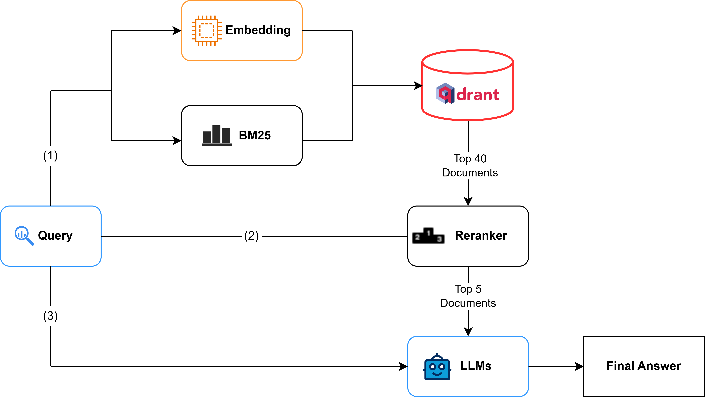

# Traffic Law QA System 🚗

## Overview

A comprehensive chatbot system designed to answer questions about traffic laws intelligently using RAG (Retrieval-Augmented Generation). This system combines:

- **Vector Database (Qdrant)**: Efficiently stores and retrieves legal documents using semantic search
- **LLM Integration**: Leverages advanced language models (OpenAI API) for generating accurate, contextual responses
- **Reranking Service**: Ensures the most relevant information is prioritized in responses
- **Web Interface**: User-friendly Next.js frontend for seamless interaction
- **RESTful API**: Robust FastAPI backend handling all business logic

The system is optimized for accuracy and performance, making it easy for users to find answers to traffic law questions without manually searching through complex legal documents.



## 📋 Prerequisites

Ensure you have the following installed on your system:
- **Python**: 3.10.19
- **Node.js**: v22.19.0
- **npm** (Node Package Manager)
- **Docker** (optional, for running Qdrant locally)

## 🚀 How to run

### 1. Environment Setup

The project includes a `.env.example` file. Create a `.env` file in the root directory and fill in your credentials:

```bash
cp .env.example .env
# On Windows Command Prompt: copy .env.example .env
# On Windows PowerShell: Copy-Item .env.example .env
```

Update the `.env` file with your specific configuration:
```env
# Qdrant Vector Database
QDRANT_ID=your-qdrant-id
QDRANT_URL=http://localhost:6335 # Or your cloud URL
QDRANT_API_KEY=your-qdrant-api-key

# OpenAI & Server Configuration
OPENAI_API_KEY=your-openai-api-key
SERVER_API_KEY=your-server-api-key
BACKEND_PORT=8000

# Frontend Configuration
NEXT_PUBLIC_BACKEND_URL=http://localhost:8000
NEXT_PUBLIC_BACKEND_API_KEY=your-server-api-key
```

### 2. Install Dependencies

Install the required Python packages:

```bash
pip install -r requirements.txt
```

### 3. Prepare Data (Optional)

If you need to crawl new data:

```bash
cd law-crawler
# Place PDF files in data/ folder
python crawl_data.py
# Output will be in output/traffic_laws.json
```

### 4. Setup Vector Database (Not needed if you use Cloud)

Ensure Qdrant is running (e.g., via Docker):
```bash
docker run -p 6333:6333 -p 6334:6334 \
    -v $(pwd)/qdrant_storage:/qdrant/storage:z \
    qdrant/qdrant
```

Load data into Qdrant:
```bash
cd vectorDB
python main.py
```

### 5. Setup Backend

Navigate to the backend directory and start the server:

```bash
# Navigate to backend folder
cd backend

# Start the server
uvicorn app:app --reload
```
**Backend runs on:** `http://localhost:8000`

### 6. Setup Frontend

Navigate to the frontend directory:

```bash
cd frontend

# Install dependencies
npm install

# Run development server
npm run dev
```
**Frontend runs on:** `http://localhost:3000`

### 7. Usage

1. Open your browser and go to `http://localhost:3000`.
2. Enter your questions about traffic laws.
3. The chatbot will respond with answers based on the indexed legal documents.

## 📁 Project Structure

```
traffic-law-qa-system/
├── backend/              # FastAPI server
│   ├── app.py           # Main application entry point
│   └── src/
│       ├── routers/     # API endpoints
│       ├── services/    # Business logic (RAG, LLM, Qdrant)
│       └── schemas/     # Pydantic models
├── frontend/            # Next.js application
│   └── src/
│       ├── app/         # App router pages
│       └── components/  # React components
├── law-crawler/         # Data extraction scripts
├── vectorDB/            # Vector database management
├── .env.example         # Environment variables template
└── requirements.txt     # Python dependencies
```

## 🔑 API Endpoints

- `GET /health` - Check server status
- `POST /api/agent/chat` - Chat endpoint

## 📝 Important Notes

- Make sure the `BACKEND_PORT` in `.env` matches the port you expect (default is 8000).
- The frontend expects the backend to be running at `NEXT_PUBLIC_BACKEND_URL`.
